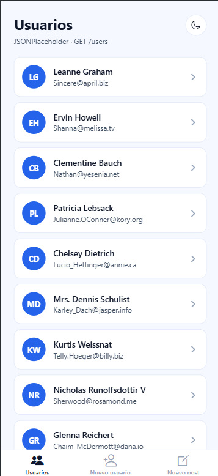
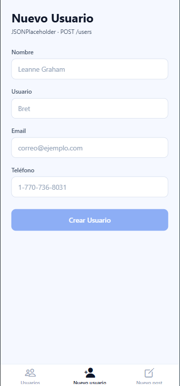
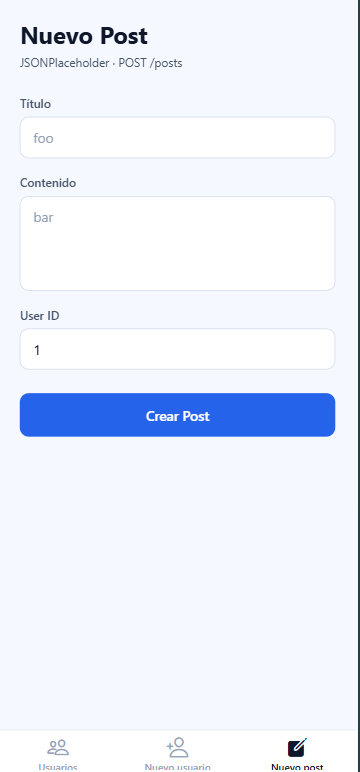
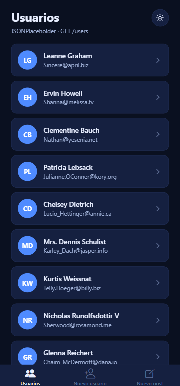
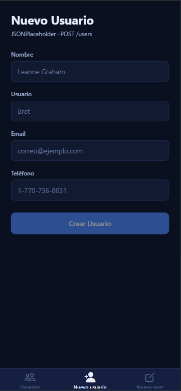
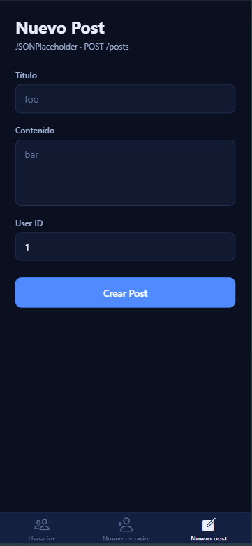

# Actividad 3 · APIs con React Native

App hecha con **Expo Router** y **TypeScript** que consume la API de [JSONPlaceholder](https://jsonplaceholder.typicode.com), con diseño minimalista y **modo claro / oscuro**.

## Pantallas

| Pestaña | Descripción |
|---|---|
| Usuarios | Lista de usuarios (`GET /users`). Al tocar uno se abre su detalle. Incluye el botón para cambiar de tema. |
| Nuevo usuario | Formulario para crear un usuario (`POST /users`). |
| Nuevo post | Formulario para crear un post (`POST /posts`). |

Además existe la pantalla de detalle: `app/user/[id].tsx` (`GET /users/:id`).

## Modo claro / oscuro

### Cómo usarlo

En la pantalla **Usuarios**, toca el botón circular de la esquina superior derecha:

- Icono de luna: cambia a modo oscuro.
- Icono de sol: cambia a modo claro.

El cambio es instantáneo en toda la app: pestañas, cabeceras, formularios y tarjetas.


### Capturas

#### Modo claro

<table>
  <tr>
    <td align="center"><br /><sub>Usuarios</sub></td>
    <td align="center"><br /><sub>Nuevo usuario</sub></td>
    <td align="center"><br /><sub>Nuevo post</sub></td>
  </tr>
</table>

#### Modo oscuro

<table>
  <tr>
    <td align="center"><br /><sub>Usuarios</sub></td>
    <td align="center"><br /><sub>Nuevo usuario</sub></td>
    <td align="center"><br /><sub>Nuevo post</sub></td>
  </tr>
</table>

### Cómo funciona

1. **`constants/theme.ts`** define dos paletas con las mismas claves: `lightColors` y `darkColors`. El tipo `Colors` obliga a que ambas tengan los mismos campos, así que si falta uno TypeScript lo avisa.
2. **`context/ThemeContext.tsx`** guarda el tema actual en un estado y expone:
   - `theme`: `"light"` o `"dark"`
   - `colors`: la paleta activa
   - `toggleTheme()`: alterna entre ambos modos
3. **`app/_layout.tsx`** envuelve toda la app con `<ThemeProvider>`.
4. Cada componente llama a `useTheme()` y se vuelve a renderizar solo cuando el tema cambia.

### Paleta (azul)

| Token | Claro | Oscuro |
|---|---|---|
| `background` | `#F5F8FF` | `#0A1020` |
| `card` | `#FFFFFF` | `#152040` |
| `text` | `#0F172A` | `#E8EEFF` |
| `primary` | `#2563EB` | `#4F8BFF` |
| `border` | `#DBE4F5` | `#22305A` |
| `error` | `#DC2626` | `#F87171` |

Para cambiar los colores, edita solo `constants/theme.ts`. Si agregas una clave en `lightColors`, agrégala también en `darkColors`.

### Comportamiento actual

- La app **siempre arranca en modo claro**.
- La elección **no se guarda** al cerrar la app.

## Estructura

```
├── app/
│   ├── _layout.tsx            ThemeProvider + Stack
│   ├── (tabs)/
│   │   ├── _layout.tsx        Barra de navegación inferior
│   │   ├── index.tsx          Usuarios + botón de tema
│   │   ├── new-user.tsx
│   │   └── new-post.tsx
│   └── user/[id].tsx          Detalle de usuario
├── components/                Field, Feedback, UserCard, ThemeToggle
├── constants/                 theme.ts (paletas), api.ts
├── context/                   ThemeContext.tsx
├── hooks/                     useUsers, useUser, useCreateUser, useCreatePost
└── types/                     user.ts, post.tsx
```
